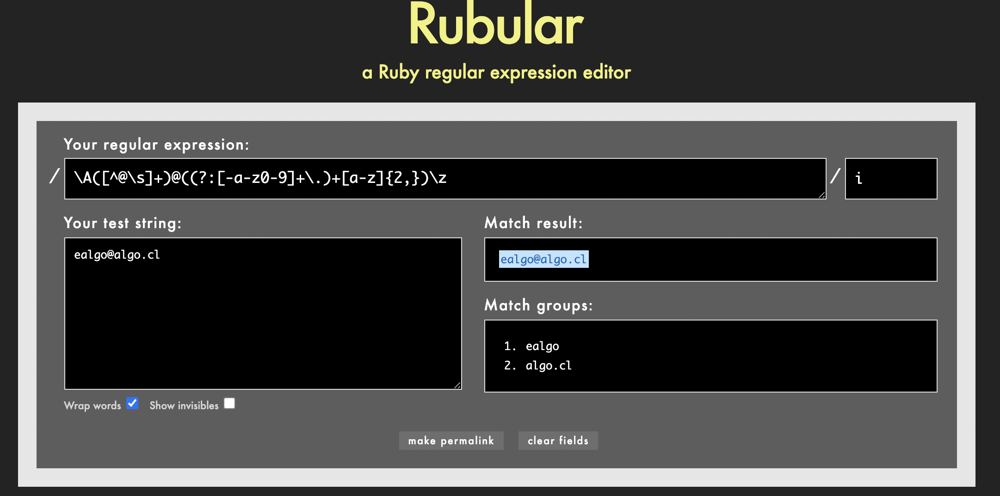

1.- $ git add .

2.- $ git commit -m'commit'

3.- $ git push heroku master


https://pure-peak-48421.herokuapp.com/articles

test_app_6 (video):

$ rails g scaffold User username:string 

ramita:

$ git checkout -b create-users-table-model

$ rails g migration create_users

$ rails db:migrate

$ rails c

```
➜  test-app git:(create-users-table-model) ✗ rails c
Running via Spring preloader in process 3779
Loading development environment (Rails 6.1.4.1)
3.0.0 :001 > User.all
   (0.8ms)  SELECT sqlite_version(*)
  User Load (0.4ms)  SELECT "users".* FROM "users" /* loading for inspect */ LIMIT ?  [["LIMIT", 11]]
 => #<ActiveRecord::Relation []>
3.0.0 :002 > User
 => User(id: integer, username: string, email: string, created_at: datetime, updated_at: datetime)
3.0.0 :003 > User.create(username: 'ewi', email: 'ewi@ejemplo.cl')
  TRANSACTION (0.1ms)  begin transaction
  User Create (2.7ms)  INSERT INTO "users" ("username", "email", "created_at", "updated_at") VALUES (?, ?, ?, ?)  [["username", "ewi"], ["email", "ewi@ejemplo.cl"], ["created_at", "2021-09-24 15:17:15.242480"], ["updated_at", "2021-09-24 15:17:15.242480"]]
  TRANSACTION (0.7ms)  commit transaction
 => #<User id: 1, username: "ewi", email: "ewi@ejemplo.cl", created_at: "2021-09-24 15:17:15.242480000 +0000", updated_at: "2021-09-24 15:17:15.242480000 +0000">
3.0.0 :004 > user = User.first
  User Load (0.9ms)  SELECT "users".* FROM "users" ORDER BY "users"."id" ASC LIMIT ?  [["LIMIT", 1]]
 => #<User id: 1, username: "ewi", email: "ewi@ejemplo.cl", created_at:...
3.0.0 :005 > user
 => #<User id: 1, username: "ewi", email: "ewi@ejemplo.cl", created_at: "2021-09-24 15:17:15.242480000 +0000", updated_at: "2021-09-24 15:17:15.242480000 +0000">
3.0.0 :006 > user.email = 'ewi1@ejemplo.cl'
 => "ewi1@ejemplo.cl"
3.0.0 :007 > user.save
  TRANSACTION (0.2ms)  begin transaction
  User Update (0.6ms)  UPDATE "users" SET "email" = ?, "updated_at" = ? WHERE "users"."id" = ?  [["email", "ewi1@ejemplo.cl"], ["updated_at", "2021-09-24 15:19:11.739822"], ["id", 1]]
  TRANSACTION (0.9ms)  commit transaction
 => true
3.0.0 :008 > User.all
  User Load (1.6ms)  SELECT "users".* FROM "users" /* loading for inspect */ LIMIT ?  [["LIMIT", 11]]
 => #<ActiveRecord::Relation [#<User id: 1, username: "ewi", email: "ewi1@ejemplo.cl", created_at: "2021-09-24 15:17:15.242480000 +0000", updated_at: "2021-09-24 15:19:11.739822000 +0000">]>
3.0.0 :009 > User.first
  User Load (0.4ms)  SELECT "users".* FROM "users" ORDER BY "users"."id" ASC LIMIT ?  [["LIMIT", 1]]
 => #<User id: 1, username: "ewi", email: "ewi1@ejemplo.cl", created_at: "2021-09-24 15:17:15.242480000 +0000", updated_at: "2021-09-24 15:19:11.739822000 +0000">
```


Validaciones:

```
user = User.new(username: 'aa', email: 'aa@ejemplo.com')
   (0.8ms)  SELECT sqlite_version(*)
 => #<User id: nil, username: "aa", email: "aa@ejemplo.com", created_at...
3.0.0 :003 > user.valid?
 => false
```

Si intentamos guardarlo, nos dará un error, ya que no cumple con la validación:

```
user.save
 => false
```

```
 user.errors.full_messages
 => ["Username is too short (minimum is 3 characters)"]
```

***Validaciones***

```
class User < ApplicationRecord
    validates :username, 
        presence: true, 
        uniqueness: { case_sensitive: false },
        length: { minimum: 3, maximum: 25 }
    
    VALID_EMAIL_REGEX = /\A([^@\s]+)@((?:[-a-z0-9]+\.)+[a-z]{2,})\z/i
    validates :email, 
        presence: true, 
        uniqueness: { case_sensitive: false }, 
        length: { maximum: 105 },
        format: { with: VALID_EMAIL_REGEX }

end
```



Validaciones desde la consola:

```
reload!
Reloading...
 => true
3.0.0 :021 > user = User.new(username: 'madagascar', email: 'madagascar.com')

   (0.1ms)  SELECT sqlite_version(*)
 => #<User id: nil, username: "madagascar", email: "madagascar.com", cr...
3.0.0 :022 > user.valid?
  User Exists? (1.4ms)  SELECT 1 AS one FROM "users" WHERE LOWER("users"."username") = LOWER(?) LIMIT ?  [["username", "madagascar"], ["LIMIT", 1]]
  User Exists? (0.2ms)  SELECT 1 AS one FROM "users" WHERE LOWER("users"."email") = LOWER(?) LIMIT ?  [["email", "madagascar.com"], ["LIMIT", 1]]
 => false
3.0.0 :023 > user.errors.full_messages
 => ["Email is invalid"]
```


validaciones:

```
user = User.new(username: 'madagascar', email: 'madagascar@ejemp
lo.com')
 => #<User id: nil, username: "madagascar", email: "madagascar@ejemplo....
3.0.0 :025 > user.valid?
  User Exists? (1.7ms)  SELECT 1 AS one FROM "users" WHERE LOWER("users"."username") = LOWER(?) LIMIT ?  [["username", "madagascar"], ["LIMIT", 1]]
  User Exists? (0.2ms)  SELECT 1 AS one FROM "users" WHERE LOWER("users"."email") = LOWER(?) LIMIT ?  [["email", "madagascar@ejemplo.com"], ["LIMIT", 1]]
 => true
```

Guardémoslo:

```
user.save
  TRANSACTION (0.6ms)  begin transaction
  User Exists? (0.7ms)  SELECT 1 AS one FROM "users" WHERE LOWER("users"."username") = LOWER(?) LIMIT ?  [["username", "madagascar"], ["LIMIT", 1]]
  User Exists? (0.1ms)  SELECT 1 AS one FROM "users" WHERE LOWER("users"."email") = LOWER(?) LIMIT ?  [["email", "madagascar@ejemplo.com"], ["LIMIT", 1]]
  User Create (6.7ms)  INSERT INTO "users" ("username", "email", "created_at", "updated_at") VALUES (?, ?, ?, ?)  [["username", "madagascar"], ["email", "madagascar@ejemplo.com"], ["created_at", "2021-09-24 17:14:04.432120"], ["updated_at", "2021-09-24 17:14:04.432120"]]
  TRANSACTION (0.7ms)  commit transaction
 => true
```

Asociación entre Articles y User:

Modelo de User:

```ruby
class User < ApplicationRecord
  has_many :articles
end
```

Modelo de Article:

```ruby
class Article < ApplicationRecord
  belongs_to :user
end
```


Actualización de registros con el atributo faltante, user_id:

```
3.0.0 :001 > Article.update_all(user_id: User.first.id)
   (0.6ms)  SELECT sqlite_version(*)
  User Load (0.3ms)  SELECT "users".* FROM "users" ORDER BY "users"."id" ASC LIMIT ?  [["LIMIT", 1]]
  Article Update All (0.8ms)  UPDATE "articles" SET "user_id" = ?  [["user_id", 1]]
 => 11
```

index.html.erb

```ruby
   by <%= a.user.username if a.user %>
```

show.html.erb

```ruby
   by <%= @article.user.username if @article.user %>
```

Pasword:

```ruby
rails g migration add_password_digest_to_users
```

Gemfile:

```ruby
gem 'bcrypt', '~> 3.1.7'

```

user.rb

```ruby
class User < ApplicationRecord
  before_save { self.email = email.downcase }
  has_many :articles
  validates :username, 
      presence: true, 
      uniqueness: { case_sensitive: false },
      length: { minimum: 3, maximum: 25 }
    
  VALID_EMAIL_REGEX = /\A([^@\s]+)@((?:[-a-z0-9]+\.)+[a-z]{2,})\z/i
  validates :email, 
      presence: true, 
      uniqueness: { case_sensitive: false }, 
      length: { maximum: 105 },
      format: { with: VALID_EMAIL_REGEX }
has_secure_password
end

```

```ruby
class AddPasswordDigestToUsers < ActiveRecord::Migration[6.1]
  def change
    add_column :users, :password_digest, :string
  end
end
```

Rails c

```
3.0.0 :001 > User.all
...
3.0.0 :002 > BCrypt::Password.create('password')
 => "$2a$12$YQ1DP9h/Piyl4Rqt0ahemOdxmm/fcdcDYJp5hFlanZUQmWQQHf/.u"
```

¿Qué pasa si lo vuelvo a ejecutar?

Nos devolverá hash diferentes por cada vez que ejecutemos:

```
3.0.0 :003 > BCrypt::Password.create('password')
 => "$2a$12$UHwVD5SAgICezt9vQBH5mu0iZ8ydL.r2uIQ4bvm/UneEpT6CKHkFy"
3.0.0 :004 > BCrypt::Password.create('password')
 => "$2a$12$U4TQMMXbnmpozE2LBo2eHe5z8Y/T8Dccadu400trJ9kYHp7y7VW9m"
```


Guardarlo en variable:

```
3.0.0 :005 > password = _
 => "$2a$12$U4TQMMXbnmpozE2LBo2eHe5z8Y/T8Dccadu400trJ9kYHp7y7VW9m"
3.0.0 :006 > password
 => "$2a$12$U4TQMMXbnmpozE2LBo2eHe5z8Y/T8Dccadu400trJ9kYHp7y7VW9m"
```

```
3.0.0 :007 > password.salt
 => "$2a$12$U4TQMMXbnmpozE2LBo2eHe"
```

Asignar contraseña:

```
3.0.0 :009 > User.last
  User Load (0.9ms)  SELECT "users".* FROM "users" ORDER BY "users"."id" DESC LIMIT ?  [["LIMIT", 1]]
 => #<User id: 4, username: "janetdoe", email: "janetdoe@ejemplo.com", created_at: "2021-09-26 00:37:30.756287000 +0000", updated_at: "2021-09-26 00:37:30.756287000 +0000", password_digest: nil>
3.0.0 :010 > user = User.last
  User Load (0.3ms)  SELECT "users".* FROM "users" ORDER BY "users"."id" DESC LIMIT ?  [["LIMIT", 1]]
 => #<User id: 4, username: "janetdoe", email: "janetdoe@ejemplo.com", ...
3.0.0 :011 > user.password = 'password123'
 => "password123"
3.0.0 :012 > user.save
  TRANSACTION (0.1ms)  begin transaction
  User Exists? (0.4ms)  SELECT 1 AS one FROM "users" WHERE LOWER("users"."username") = LOWER(?) AND "users"."id" != ? LIMIT ?  [["username", "janetdoe"], ["id", 4], ["LIMIT", 1]]
  User Exists? (0.1ms)  SELECT 1 AS one FROM "users" WHERE LOWER("users"."email") = LOWER(?) AND "users"."id" != ? LIMIT ?  [["email", "janetdoe@ejemplo.com"], ["id", 4], ["LIMIT", 1]]
  User Update (1.2ms)  UPDATE "users" SET "updated_at" = ?, "password_digest" = ? WHERE "users"."id" = ?  [["updated_at", "2021-09-26 01:35:36.245160"], ["password_digest", "$2a$12$aZzUfoJosnjxgs8IA9aKme6drwdjkmKmknlg5MyCudUS2tPnynOWW"], ["id", 4]]
  TRANSACTION (1.1ms)  commit transaction
 => true
```

Si reviso los usuarios, nos entrega un password filtrado:

```
3.0.0 :013 > User.all
  User Load (1.8ms)  SELECT "users".* FROM "users" /* loading for inspect */ LIMIT ?  [["LIMIT", 11]]
 => #<ActiveRecord::Relation [#<User id: 1, username: "ewi", email: "ewi1@ejemplo.cl", created_at: "2021-09-24 15:17:15.242480000 +0000", updated_at: "2021-09-24 15:19:11.739822000 +0000", password_digest: nil>, #<User id: 2, username: "madagascar", email: "madagascar@ejemplo.com", created_at: "2021-09-24 17:14:04.432120000 +0000", updated_at: "2021-09-24 17:14:04.432120000 +0000", password_digest: nil>, #<User id: 3, username: "janedoe", email: "JanEDoE@ejemplo.com", created_at: "2021-09-26 00:33:52.474196000 +0000", updated_at: "2021-09-26 00:33:52.474196000 +0000", password_digest: nil>, #<User id: 4, username: "janetdoe", email: "janetdoe@ejemplo.com", created_at: "2021-09-26 00:37:30.756287000 +0000", updated_at: "2021-09-26 01:35:36.245160000 +0000", password_digest: [FILTERED]>]>
3.0.0 :014 >
```

Comprobar en la consola la contraseña:

```
3.0.0 :014 > user.authenticate('wrongpassword')
 => false
3.0.0 :015 > user.authenticate('password')
 => false
3.0.0 :016 > user.authenticate('password123')
 => #<User id: 4, username: "janetdoe", email: "janetdoe@ejemplo.com", created_at: "2021-09-26 00:37:30.756287000 +0000", updated_at: "2021-09-26 01:35:36.245160000 +0000", password_digest: [FILTERED]>
3.0.0 :017 >
```

Nos entrega las rutas especificadas con grep:

$ rails routes --expanded | grep edit

Actualizar email:

```
3.0.0 :001 > user = User.find(3)
   (0.5ms)  SELECT sqlite_version(*)
  User Load (0.4ms)  SELECT "users".* FROM "users" WHERE "users"."id" = ? LIMIT ?  [["id", 3], ["LIMIT", 1]]
 => #<User id: 3, username: "janedoe-edited", email: "janedoe@ejemplo....
3.0.0 :002 > user.email = "eva@recorrido.cl"
 => "eva@recorrido.cl"
3.0.0 :003 > user.save
  TRANSACTION (0.4ms)  begin transaction
  User Exists? (0.6ms)  SELECT 1 AS one FROM "users" WHERE LOWER("users"."username") = LOWER(?) AND "users"."id" != ? LIMIT ?  [["username", "janedoe-edited"], ["id", 3], ["LIMIT", 1]]
  User Exists? (0.1ms)  SELECT 1 AS one FROM "users" WHERE LOWER("users"."email") = LOWER(?) AND "users"."id" != ? LIMIT ?  [["email", "eva@recorrido.cl"], ["id", 3], ["LIMIT", 1]]
  User Update (5.8ms)  UPDATE "users" SET "email" = ?, "updated_at" = ? WHERE "users"."id" = ?  [["email", "eva@recorrido.cl"], ["updated_at", "2021-09-26 21:14:08.889489"], ["id", 3]]
  TRANSACTION (0.8ms)  commit transaction
 => true
```


Vamos a agregar un rol de Admin a la tabla de users:

```
rails g migration add_admin_to_users
```

En la consola:

```
User.all
user = User.first
user.admin?
=> false

3.0.0 :004 > user
 => #<User id: 1, username: "Ewi", email: "ewi1@ejemplo.cl", created_at: "2021-09-24 15:17:15.242480000 +0000", updated_at: "2021-09-26 22:58:23.818647000 +0000", password_digest: [FILTERED], admin: false>
```


Convertirlo a Admin:

```
> user.toggle!(:admin)
  TRANSACTION (0.3ms)  begin transaction
  User Update (1.3ms)  UPDATE "users" SET "updated_at" = ?, "admin" = ? WHERE "users"."id" = ?  [["updated_at", "2021-09-28 00:50:30.220537"], ["admin", 1], ["id", 1]]
  TRANSACTION (1.3ms)  commit transaction
 => true
```


Comprobemoslo:

```
> user.admin?
 => true
```


Consola de Heroku:

```
irb(main):006:0> User.all

irb(main):007:0> user = User.first
=> #<User id: 1, username: "Josefa", email: "josefa@email.com", created...
irb(main):008:0> user.toggle!(:admin)
=> true
irb(main):009:0> user
=> #<User id: 1, username: "Josefa", email: "josefa@email.com", created_at: "2021-09-28 13:28:14.346079000 +0000", updated_at: "2021-09-28 13:32:03.079063000 +0000", password_digest: [FILTERED], admin: true>
```

Visite: [Heroku app](https://pure-peak-48421.herokuapp.com/)

*********************************************************


## Test/models:

Error de test con:

```
/.../.rvm/gems/ruby-3.0.0/gems/bootsnap-1.9.1/lib/bootsnap/load_path_cache/core_ext/kernel_require.rb:34:in `require': cannot load such file -- rexml/document (LoadError)
```

***Solución***

#### Pegar esta gem en el archivo Gemfile y luego bundle:

```ruby
gem 'rexml', '~> 3.2', '>= 3.2.4'
```

Luego: `$ rails test`

```
Running via Spring preloader in process 3983
Run options: --seed 48479

# Running:


Finished in 0.172523s, 0.0000 runs/s, 0.0000 assertions/s.
0 runs, 0 assertions, 0 failures, 0 errors, 0 skips
```


#### Segunda ejecución de test, nos dice que no existe el modelo category, asi que lo creamos:

```
 rails test
Running via Spring preloader in process 4119
Run options: --seed 53549

# Running:

E

Error:
CategoryTest#test_category_should_be_valid:
NameError: uninitialized constant CategoryTest::Category
    test/models/category_test.rb:6:in `block in <class:CategoryTest>'


rails test test/models/category_test.rb:5


Finished in 0.205256s, 4.8720 runs/s, 0.0000 assertions/s.
1 runs, 0 assertions, 0 failures, 1 errors, 0 skips
```

***Modelos: `category.rb`***

```ruby
class Category < ApplicationRecord
  
end
```


#### Tercera ejecución del test, nos dice que la tabla de categories no existe, asi que la creamos:

```
rails test
Running via Spring preloader in process 4185
Run options: --seed 20498

# Running:

E

Error:
CategoryTest#test_category_should_be_valid:
ActiveRecord::StatementInvalid: Could not find table 'categories'
    test/models/category_test.rb:6:in `block in <class:CategoryTest>'


rails test test/models/category_test.rb:5


Finished in 0.204395s, 4.8925 runs/s, 0.0000 assertions/s.
1 runs, 0 assertions, 0 failures, 1 errors, 0 skips
```


#### Crear la tabla categories:

```
rails g migration create_categories
```

#### Nuestra tabla de categories deberia verse así antes de migrarla:

```ruby
class CreateCategories < ActiveRecord::Migration[6.1]
  def change
    create_table :categories do |t|
      t.string :name
      t.timestamps
    end
  end
end
```

#### La migramos y corremos el test, y vemos que no hay errores en la ejecución:

```
rails db:migrate
== 20210928145723 CreateCategories: migrating =================================
-- create_table(:categories)
   -> 0.0019s
== 20210928145723 CreateCategories: migrated (0.0020s) ========================

➜  test-app git:(master) ✗ rails test
Running via Spring preloader in process 4317
Run options: --seed 39088

# Running:

.

Finished in 0.207539s, 4.8184 runs/s, 4.8184 assertions/s.
1 runs, 1 assertions, 0 failures, 0 errors, 0 skips
```

#### En la consola:

```
 rails c
Running via Spring preloader in process 4380
Loading development environment (Rails 6.1.4.1)
3.0.0 :001 > Category.all
   (1.5ms)  SELECT sqlite_version(*)
  Category Load (0.5ms)  SELECT "categories".* FROM "categories" /* loading for inspect */ LIMIT ?  [["LIMIT", 11]]
 => #<ActiveRecord::Relation []>
3.0.0 :002 > Category
 => Category(id: integer, name: string, created_at: datetime, updated_at: datetime)
3.0.0 :003 > @category = Category.new(name: "Sports")
 => #<Category id: nil, name: "Sports", created_at: nil, updated_at: nil>
3.0.0 :004 > @category.valid?
 => true
```

******************************************************

## Test/controller:

Primero crearemos los test para category:

```
rails g test_unit:scaffold category
Running via Spring preloader in process 5210
      create  test/controllers/categories_controller_test.rb
      create  test/system/categories_test.rb
```


Va a fallar ya que le falta, el controlador, los métodos, los templates, pero después de agregarlos, esta pasa la prueba:

El test: categories_controller_test.rb

```ruby
require "test_helper"

class CategoriesControllerTest < ActionDispatch::IntegrationTest
  setup do
    @category = Category.create(name: "Sports")
  end

  test "should get index" do
    get categories_url
    assert_response :success
  end

  test "should get new" do
    get new_category_url
    assert_response :success
  end

  test "should show category" do
    get category_url(@category)
    assert_response :success
  end

end
```


```
rails test test/controllers/categories_controller_test.rb
Running via Spring preloader in process 5712
Run options: --seed 42121

# Running:

...

Finished in 5.264508s, 0.5699 runs/s, 0.5699 assertions/s.
3 runs, 3 assertions, 0 failures, 0 errors, 0 skips
```

****************************************************


## Test de integración

```
rails g integration_test create_category
```


Corremos el test:

```
rails test
Running via Spring preloader in process 7664
Run options: --seed 30531

# Running:

.....E

Error:
CreateCategoryTest#test_get_new_category_form_and_create_category:
ActionController::RoutingError: No route matches [GET] "/category/new"
    test/integration/create_category_test.rb:5:in `block in <class:CreateCategoryTest>'


rails test test/integration/create_category_test.rb:4

....

Finished in 1.335491s, 7.4879 runs/s, 7.4879 assertions/s.
10 runs, 10 assertions, 0 failures, 1 errors, 0 skips
```


Test de integración para lista de categorias:`rails g integration_test list_categories`

```
rails g migration
create_article_categories
```


Migrar en Heroku:

```
$  git push heroku master
$ heroku run rails db:migrate
$ heroku open
```

[Visita TestApp](https://pure-peak-48421.herokuapp.com/)
